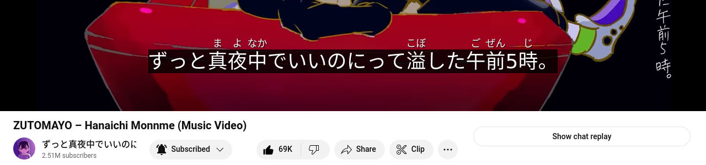

# furigana-subtitles

This browser extension adds Japanese subtitles with furigana to some Zutomayo YouTube music videos.



## Usage

1. Clone the repository
2. Install the extension
  * In Firefox:
    * Go to [about:addons](about:addons)
    * Click on "Debug Add-Ons"
    * Click on "Load Temporary Add-on..."
  * In Chrome:
    * Go to [chrome://extensions/](chrome://extensions/)
    * Enable "Developer mode"
    * Click on "Load unpacked"
3. Go to a supported Zutomayo YouTube music video, e.g. https://www.youtube.com/watch?v=H88kps8X4Mk
4. Ensure that the pinned comment is loaded, as the lyrics are taken from that pinned comment
5. Subtitles should now be added to the video

## Test

```console
npm ci
npm test
```

## References and inspirations

* https://iandevlin.com/blog/2015/02/javascript/dynamically-adding-text-tracks-to-html5-video/
* https://github.com/stjet/ztmy
